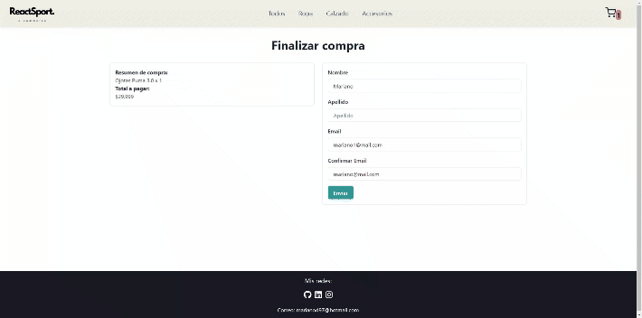

# E-commerce con React

Este proyecto es un E-commerce desarrollado en React, haciendo uso de las bibliotecas Chakra UI y React Router DOM para el curso de CoderHouse.

## Tecnologías Utilizadas

- [React](https://reactjs.org/)
- [Chakra UI](https://chakra-ui.com/)
- [React Router DOM](https://reactrouter.com/)
- [SweetAlert2](https://sweetalert2.github.io/)

## Funcionalidades Principales

- Navegación entre categorías y detalles de productos con React Router DOM.
- Estilo moderno y responsive con Chakra UI.

## Características

- **Navegación entre Categorías:** Explora una variedad de productos organizados por categorías.
- **Añadir al Carrito:** Selecciona tus productos favoritos y agrégales al carrito de compras.
- **Modificar Cantidad en el Carrito:** Ajusta la cantidad de productos directamente desde el carrito.
- **Eliminar Productos del Carrito:** Retira productos del carrito con un solo clic.
- **Formulario de Compra:** Rellena un formulario para finalizar tu compra.

## Funcionalidades Avanzadas

- **Carga Dinámica de Productos:** Los productos son cargados desde la base de datos de Firestore.
- **Gestión de Órdenes:** Al llenar el formulario de compra, el pedido es enviado a la base de datos a una colección llamada 'orders' con detalles del producto.

## Capturas de Pantalla

## Demo en Vivo

Puedes explorar la aplicación en vivo [aquí](https://pre-entrega-diaz.vercel.app/).

---

